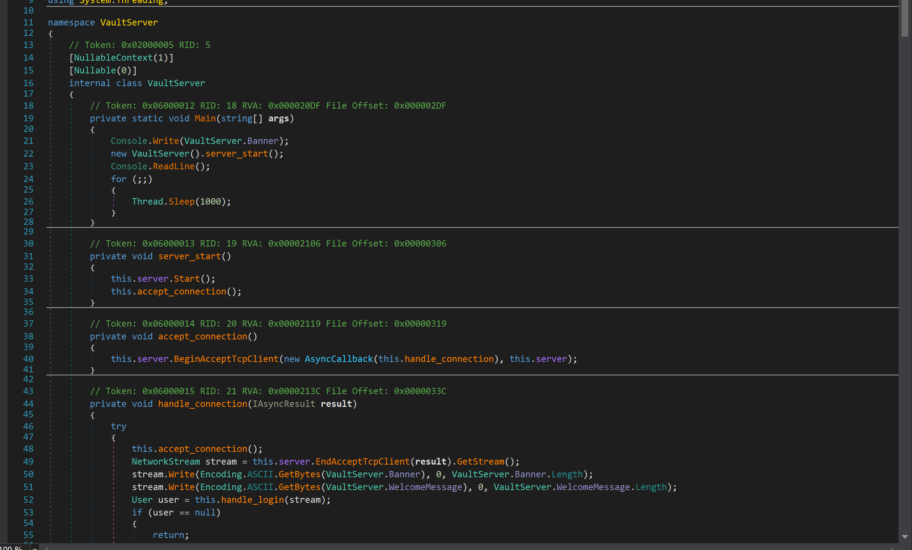
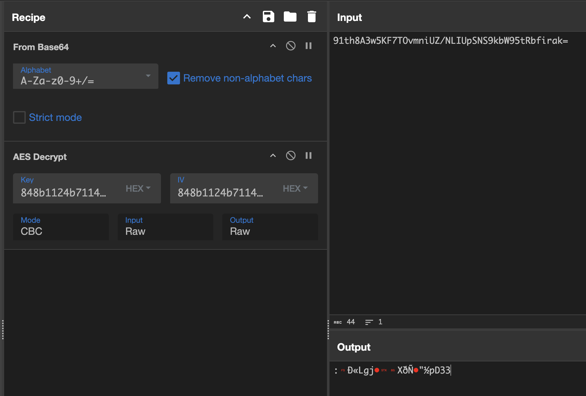
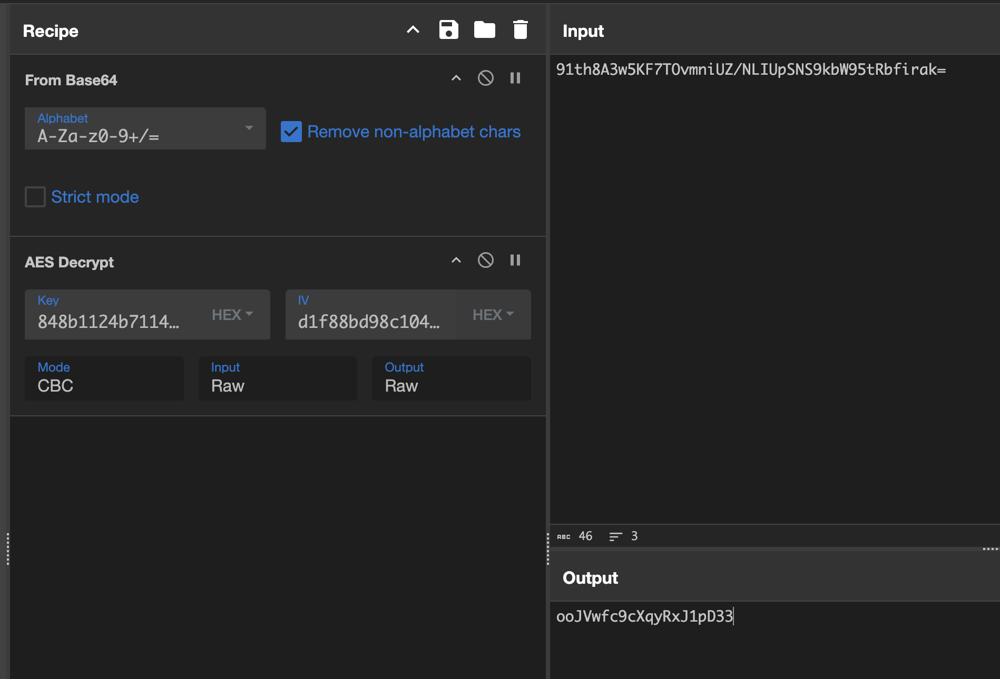
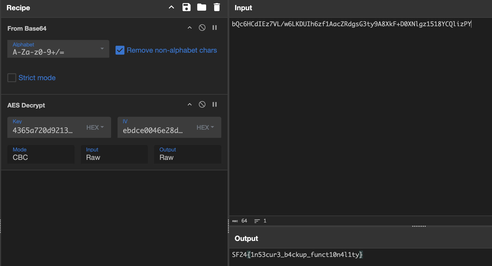

# Secure Pass Vault

```
I just finished a secure password manager for my company, I hope I didn't forget to remove any debugging code. 

Just connect via netcat to get started!
ncat --ssl securepassvault.sf24.no 1337
```

## TLDR;
 C# reverse challenge, that includes a obscured **debug** option that uses bit operators to hide what you need to put in after registering a user. You find the option by brute forcing the expression to get the correct answer that returns true. You will get the entire vault object sent back, that includes the AES key and encrypted passwords of all registered users. There is a password named flag included in the object, and you decrypt it using AES CBC.

## Introduction to the challenge
The attachment to the challenge is a dll file. I always open this first in DnSpy for the low hanging fruit. DnSpy decompiles IL code to almost 1:1 of source code. It doesn't include the variable names inside functions unless it's a dll built for debugging.

I get greeted with this in DnSpy after opening the dll and I start looking through what the file contains.  



After scrolling through the code I find this method that looks out of place, and obfuscated.
This might be used as a way to trigger debug option that can allow us extract the flag from the server.

```csharp
private bool n(string message)
{
	bool flag;
	try
	{
		if ((((int.Parse(message) ^ 120) << 2) ^ 69) == 41)
		{
			flag = true;
		}
		else
		{
			flag = false;
		}
	}
	catch (FormatException)
	{
		flag = false;
	}
	return flag;
}
```

### Explanation of obfuscated code
> The code parses the variable message that gets passed to the function as a string and parsed as integer.
> There is a conditional check that includes xor (^ operator) and left bit shift (<< operator) that needs to equal to 41
## Looking into debug option
Next step is figuring out where the method is used and what we gain from flag being set to true.
DnSpy is able analyze where the method is being used, this is very useful when working with large a program with a lot of code.
### Method that uses debug option
After analyzing the method, I see that it's used when you first connect to the Vault server on the connection of the tcp client after a user is connected and logged in. The debug method is called with user input.

```csharp
private void handle_connection(IAsyncResult result)
{
  try
  {
  this.accept_connection();

  NetworkStream stream = this.server
  .EndAcceptTcpClient(result).GetStream();

  // Banner
  stream.Write(
	Encoding.ASCII.GetBytes(VaultServer.Banner), 
	0, VaultServer.Banner.Length
	);
	
  // Welcome message
  stream.Write(
	Encoding.ASCII.GetBytes
	(VaultServer.WelcomeMessage), 
	0, 
	VaultServer.WelcomeMessage.Length
	);

  User user = this.handle_login(stream);

  if (user == null)
  {
    return;
  }

  bool flag = true;

  while (flag)
  {
	stream.Write(Encoding.ASCII.GetBytes(VaultServer.menu), 
	0, VaultServer.menu.Length);
	byte[] array = new byte[1024];
	int num = stream.Read(array, 0, array.Length);
	byte[] array2 = new byte[num];
	Array.Copy(array, array2, num);
	string text = Encoding.ASCII.GetString(array2).Trim();
	if (this.n(text))
	{
          string text2 = JsonSerializer.Serialize<Vault>
          (this.vault, null);
		
          stream.Write(
            Encoding.ASCII.GetBytes(text2), 0, 
            text2.Length);
	}
	else if (!(text == "1"))
	{
        ...
```

If we isolate the code that is ran when debug method returns true, we can better understand what happens.

```cs
if (this.n(text))
{
    string text2 = JsonSerializer.Serialize<Vault>(this.vault, null);
    stream.Write(Encoding.ASCII.GetBytes(text2), 0, text2.Length);
}
```

The code serializes the object Vault which I assume to include everything the server has, and sends it back to the client. This seems like a very insecure option that is used by developers, and not meant to be included in the program.
## How to activate debug option

I write a bruteforce script in Python as it's good for writing quick code during a CTF.

```python
def is_flag_value(value):
	return ((((value ^ 120) << 2) ^ 69) == 41)

for i in range(1000):
	if (is_flag_value(i)):
		print(i)
```

> The bit operation syntax is the same as C# so we can copy the expression over to python and create a function that returns the evaluated value from the expression. And we iterate over all numbers from 0 to 999 to see if it's within the range.

### Confirming we got it right!
The console prints **99**, next step is connecting to the server to confirm this is the right number.
After registering a user we can input 99 and get back the entire vault object in JSON!


## How to extract flag from the vault
We have the vault object now, but how do we extract the flag?
```json
{
"Users": [{
	"Username": "C9Gen",
	"AESKey": "hIsRJLcRRtMl3YA1JCrA0NH4i9mMEE91RI2pvKfGqFw=",
	"Vault": [{
		"PasswordName": "jtPubtwh5Dm4AA82hUVu",
		"EncryptedPassword": "91th8A3w5KF7TOvmniUZ/NLIUpSNS9kbW95tRbfirak="
	},
	...
	],
	"VaultPassword": "g9gakv5K1VgNywM93piOAicRS1MPsA6ycWrdIKNZ8uI="
	}]
}

```

> The vault includes a list of users and their AESKey, Vault and VaultPassword. The goal here is to be using AES encryption method to decrypt the EncryptedPasswords that are in the vault. We can use the C# code to figure out how to decrypt the password from the vault.

### Decrypting the passwords
There are multiple methods to look at to figure out how it encrypts/decrypts.
Easiest to analyze is "handle_retrieve_password" since it gives insight what method it uses at end before sending the password back to the user.

```cs
string text2 = AesEncryption.Decrypt
(
    Convert.FromBase64String(user.Vault[num3 - 1].EncryptedPassword),
    Convert.FromBase64String(user.AESKey), 
    Convert.FromBase64String(user.AESKey)
);
```
> It uses a method that is in the class AesEncryption, that needs 3 parameters to be called.
> Which we can assume is content that needs to be decrypted, key and IV.

So I put this into [CyberChef](https://gchq.github.io/CyberChef/) to decrypt with the values we got.



But the output doesn't give us human readable output? I was a bit stuck here, and tried out multiple ways to decode the text, as I thought it could be something else than ASCII. But I had no luck, so back to reading the code.

```cs
public static string Decrypt(byte[] ciphertext, byte[] key, byte[] iv)
{
    string @string;
    using (Aes aes = Aes.Create())
    {
        byte[] array = new byte[iv.Length - 16];
        Array.Copy(iv, 16, array, 0, iv.Length - 16);
        aes.Key = key;
        aes.IV = array;
        ICryptoTransform cryptoTransform = aes.CreateDecryptor(aes.Key, aes.IV);
```
> The code uses the last 16 bytes from the key to be used as IV values

So after we split the hex key used in CyberChef we get back a human readable password



### The flag
The flag password was found when searching **flag** in the search box.
and was on user **9vsTn** with AESKey ``Q2WnINkhO3Yqsll1IMN6D+vc4ARuKNDaXkCCR7xmFGE=``

```json
{
	"PasswordName": "Flag",
	"EncryptedPassword": 
	"bQc6HCdIEz7VL/w6LKDUIh6zf1AacZRdgsG3ty9A8XkF+D0XNlgz1518YCQlizPY"
},
```

And when decrypted we get the flag: `SF24{1n53cur3_b4ckup_funct10n4l1ty}`  


